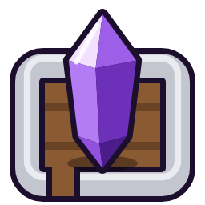
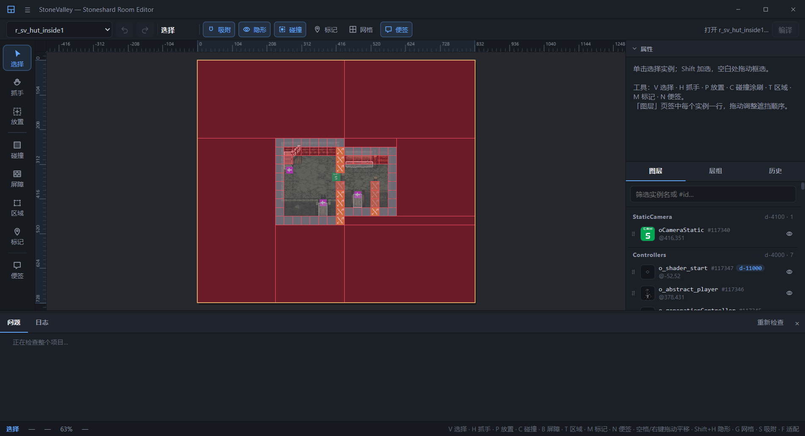
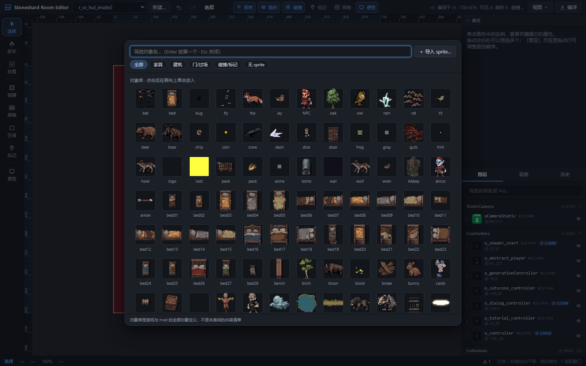
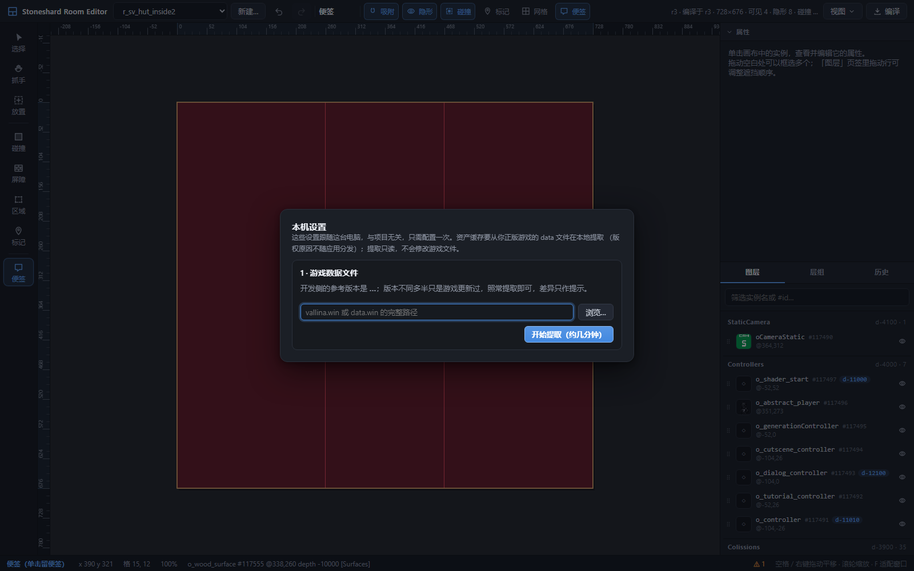
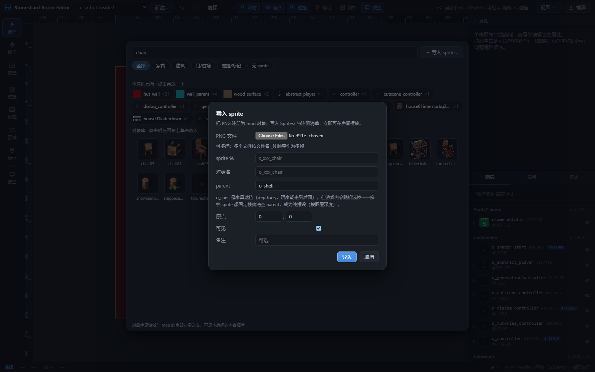
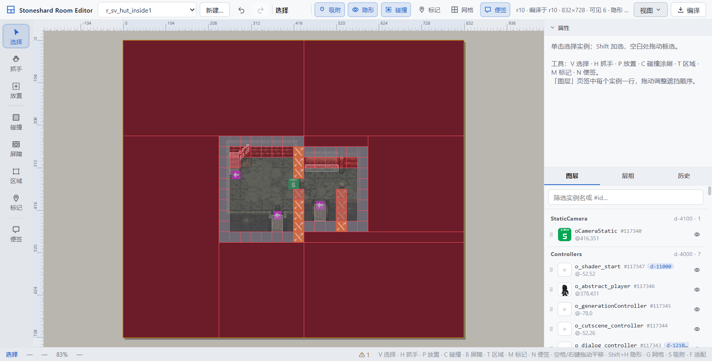

<p align="center"></p>

<h1 align="center">Stoneshard Room Editor</h1>

<p align="center"><b>A desktop editor for Stoneshard rooms — the canvas is the game.</b><br>
Humans paint on the canvas, agents drive the CLI — both work on the same git-friendly room project.</p>

<p align="center">
  <a href="https://github.com/altairwei/stoneshard-room-editor/actions/workflows/release.yml"></a>
  
  
  
</p>

<p align="center"></p>

## What it is

A Windows desktop app (Electron + PixiJS) for editing Stoneshard rooms. The canvas renders
by the game's own rules — sprites, frames, scaling and draw order all match the game — and
one click compiles the result into C# the game reads. Room data is the same JSON format
ModShardLauncher's `Msl.AddRoomJson` consumes, stored next to your mod's sources in git.

- **WYSIWYG canvas**: drawn in runtime depth order by default, so what you see is the game's
  real occlusion (switch to the static view to audit the raw data). Fidelity is
  pixel-verified against in-game screenshots: indoors, after fitting out the global
  lighting gain, **100% of pixels are within ≤ 6 of the game**.
- **One document, humans and agents**: every room = a vanilla base + an append-only op log
  (`rooms/<name>.room.json`, with author, time and comments). All six ops (add / delete /
  set / relayer / room / layer) carry an `expect` optimistic lock — a stale edit is rejected
  with 409 instead of overwriting newer work, and undo history is per-author.
- **git friendly**: the project is plain text and every change is reviewable. `compile`
  replays the log onto the base, writes a `compiled.json` snapshot and regenerates
  `<Mod>.Rooms.g.cs` — the room JSON travels into the `.sml` as a C# raw string constant.
- **No game assets shipped**: not a single byte of proprietary art in this repo or the app.
  A first-run machine-setup wizard extracts the asset cache from *your own* copy of the
  game via UndertaleModTool CLI (read-only, a few minutes).
- **Bring your own sprites**: import a PNG and it is registered as an object — written to
  `Sprites/` and `assets.json`; the same declaration drives both editor rendering and
  in-game registration via `<Mod>.Assets.g.cs`.
- **中文 / English / Русский** (including the native menu), in light and dark themes.

## Screenshots

| Object library · place sprites straight from the game asset cache | Machine setup · extract the cache from your own game (read-only) |
|:---:|:---:|
|  |  |

| Import sprite · register a PNG as a mod object, placeable immediately | Light theme (dark theme above) |
|:---:|:---:|
|  |  |

## Download & install

Builds are published through GitHub Actions (no Releases yet — download from the run page):

1. Open [Actions · release](https://github.com/altairwei/stoneshard-room-editor/actions/workflows/release.yml)
   and pick the latest successful run (runs on `v*` tags, or trigger one manually).
2. Download the `windows-x64` artifact at the bottom of the run page.
3. Pick one:
   - **Installer** — run `Stoneshard Room Editor Setup x.y.z.exe` (NSIS, install location selectable);
   - **Portable** — extract `Stoneshard Room Editor-x.y.z-win.zip` and launch `Stoneshard Room Editor.exe`.

First launch runs the machine-setup wizard: locate the game data file → extract the asset
cache (a few minutes) → scan decompiled sources (skippable). Then pick a mod source folder
from the welcome page — "New project…" only scaffolds the editor files (`rooms/`, `Sprites/`,
`assets.json`); the mod itself is built by MSL.

> CI artifacts are unsigned; SmartScreen will warn on first launch ("More info" → "Run anyway").

## Quick start (from source)

```bash
npm install
npm run extract     # first run or after a game update: export the asset cache from vallina.win (minutes, ~435 MB)
npm run dev         # browser form: http://localhost:5178/?room=r_sv_hut_inside1
npm run app         # Electron desktop form (run npm run build:app once first)
npm run app:dev     # dev form: desktop shell + a vite server with HMR
```

`svre.config.json` (`modDir` / `assetsDir` / `sourceDir` / `vanillaWin` / `utmtCli`) points
the editor at your mod, the asset cache and the game files — the full key table, environment
overrides and project rules are in the [manual](docs/manual.md).

## How it works

A room is a **base + an append-only op log**: the base is an export of a vanilla room, and
each entry in the log is one change. There are exactly six ops (`add / delete / set /
relayer / room / layer`), all guarded by an `expect` optimistic lock.

The dev server owns the document: the editor is a view + command client, agents go through
HTTP / the `svre` CLI — same ops, same rules, same per-author undo history. `compile`
replays the log onto the base, writes the `compiled.json` snapshot and self-heals
`<Mod>.Rooms.g.cs`. A file that no longer matches the snapshot is *drift* — never silently
overwritten.

Render sources, the byte-level save guarantees, the `create.json` event scan and the rest
live in the [manual](docs/manual.md).

## For agents: the svre CLI

```bash
python cli/svre.py rooms                       # project status (uncompiled / drift / generated ownership)
python cli/svre.py describe r_x                # overview + door chain + problems
python cli/svre.py apply r_x --ops ops.json --label "..." --by claude
python cli/svre.py compile r_x                 # compile + regenerate Rooms.g.cs
python cli/svre.py render r_x out.png --grid   # offscreen render for verification
```

Agents and humans collaborate on the same document; the same `expect` locks make sure
neither overwrites the other's newer work. The matching Claude skill lives in the mod repo
at `.claude/skills/stoneshard-room-editor`.

## Build & release

```bash
npm run dist   # build:app + vendor:utmt + electron-builder: installer (NSIS) + portable zip
```

Artifacts land in `release/`. The [release workflow](.github/workflows/release.yml) runs the
same chain on windows-latest for every `v*` tag (or a manual dispatch) and uploads both
packages as the `windows-x64` artifact. CI artifacts are unsigned; to sign, configure
`CSC_LINK` / `CSC_KEY_PASSWORD` secrets and drop `CSC_IDENTITY_AUTO_DISCOVERY: "false"`
from the workflow.

## Documentation

- [docs/manual.md](docs/manual.md) — the full manual (Chinese): data model, every editor
  control and shortcut, project rules, the setup wizard, packaging and vendoring, the CLI,
  the byte-level save guarantees, and where the rendering comes from.

## Credits

- [UndertaleModTool](https://github.com/UnderminersTeam/UndertaleModTool) — its
  `UndertaleModCli` does the extraction and decompilation (MIT, redistributed with the app).
- [ModShardLauncher](https://github.com/ModShardTeam/ModShardLauncher) — the in-game room
  JSON format (`Msl.AddRoomJson`) and the mod packaging chain.
- Stoneshard and all its game assets are © Ink Stains Games. Neither this repo nor the
  shipped app contains any of them.
